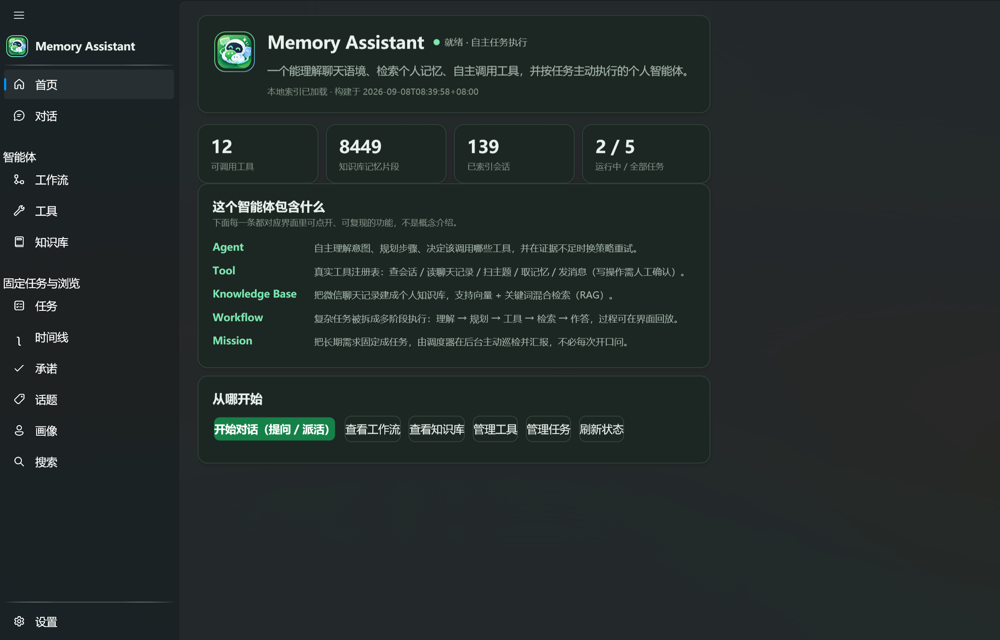
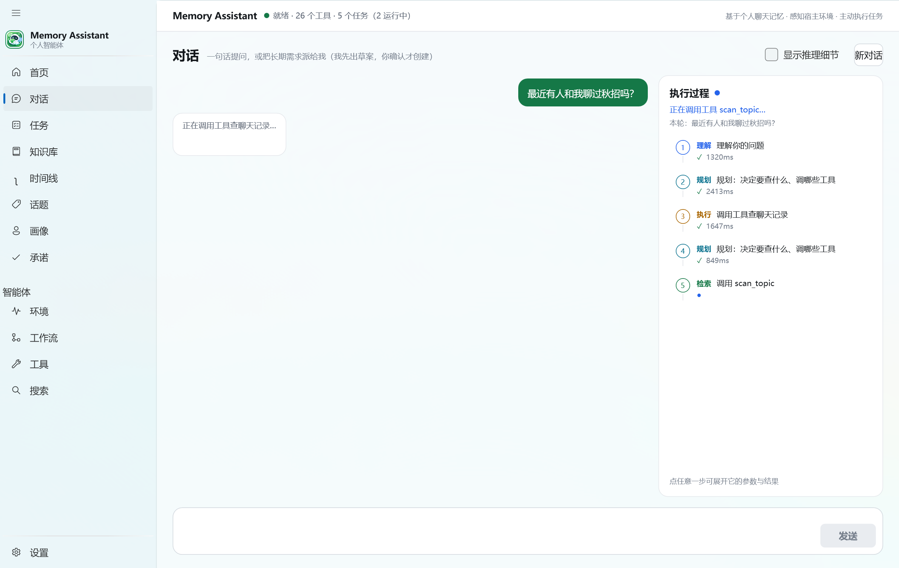
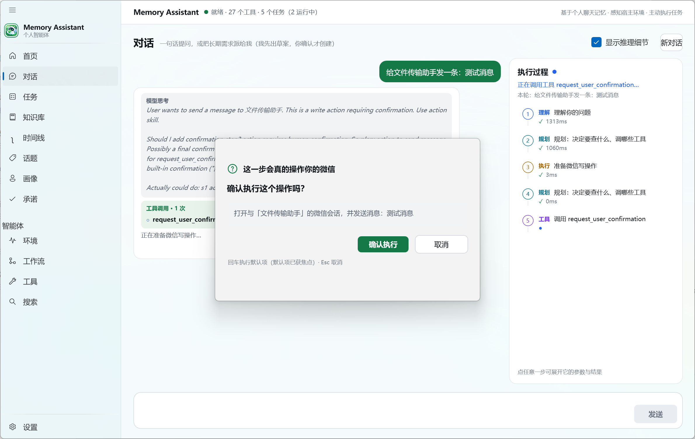

# Memory Assistant

> 本地优先的微信聊天记录回忆助手 · C# / WPF · 自写 Agent 运行时

[](#快速开始)
[](#快速开始)
[](#架构)
[](#测试)

用自然语言问一句「去年我和谁聊过秋招」「我答应过别人什么事还没做」，助手会自己规划步骤、调用工具，
在**本地索引**与**聊天原文**之间完成两级取证，最后给出**带来源引用**的回答——每条结论都能点开看原文。

两条贯穿全局的原则：

- **Workflow 负责确定性，Agent 负责灵活探索。**
- **向量检索只负责定位区域，工具读取原文完成精确取证。**

## 特性

- **自主 Agent 循环** — `Plan → Execute → Evaluate → Replan`。模型产出的计划先过代码级校验，非法计划不会进入执行器；LLM 不可用或返回脏 JSON 时静默回退规则规划（零 token）。
- **两级检索** — 向量粗排定位「哪些会话、哪一天」，再由工具精读原文取证。粗排的定位误差不会变成事实错误。
- **可追溯回答** — 证据具备完整生命周期（候选 → 观测 → 验证 → 引用）与稳定编号，回答里的 `[N]` 可点开原文。
- **多轮追问** — 「他 / 那条 / 还有吗 / 第 N 条」能接住上文，「展开第 N 条」直接复用上一轮证据而不重复检索。
- **工具注册表 + 清单热注册** — 工具声明真实 JSON Schema（参数类型、必填、取值范围）；往 `data/tools/` 丢一个 `*.tool.json` 即可上架新工具，删除即下架。
- **任务与常驻** — 一次性需求可固化成任务，交由后台调度器按周期执行；关窗不退出，托盘常驻。
- **算力克制** — Eco 模式在数据读取的唯一漏斗处限流，另有工具次数 / 失败次数 / 任务超时 / 换策略轮数四类预算；embedding 在本地推理，检索不依赖云向量库。
- **写操作安全边界** — 默认只读；发送消息等写操作必须经人工确认，可选择「以后都允许」并全程留痕。

## 界面

| 概览 | 对话与执行过程 |
| --- | --- |
|  |  |

写操作前的人工确认：模型可以发起意图，但必须由人点头才会真正执行。



## 快速开始

### 环境要求

- Windows 10 19041+ / Windows 11（x64）
- [.NET SDK 10](https://dotnet.microsoft.com/download)
- Python 3.11 —— 安装后需把 `MemoryAssistant.App/appsettings.json` 里的 `pythonBridge.pythonExePath` 改成你的解释器路径（或用环境变量 `PYTHON_EXE_PATH` 覆盖）
- 聊天数据访问依赖独立的 `wxchat` 数据适配 SDK（**本仓库不包含**，路径配置在 `python_bridge/wxchat_adapter.py` 顶部）

### 构建与运行

```powershell
git clone https://github.com/NNULZH/MemoryAssistant.git
cd MemoryAssistant
dotnet build MemoryAssistant.slnx

# 自检：不调用 LLM、不消耗 token
dotnet run --project MemoryAssistant.App -- --smoke

# 启动图形界面
dotnet run --project MemoryAssistant.App
```

### 配置模型

程序不内置任何密钥。任选一种方式：

**环境变量（推荐）**

```powershell
$env:LLM_API_KEY = "sk-..."
```

**本机配置文件** — 在 `MemoryAssistant.App/` 下新建 `appsettings.local.json`（已 gitignore）：

```json
{
  "llm": { "apiKey": "sk-...", "model": "deepseek-flash" }
}
```

**图形界面** — 启动后在「设置」页填入 API Key 并点击保存。该页是显式保存：有改动未保存时会提示，避免误以为已自动生效。

## 架构

```
WPF 桌面端 (MemoryAssistant.App)                    MVVM + WPF-UI
        │
        ▼
应用核心 (Core / Infrastructure / Features)
        ├── AgentOrchestrator    计划 → 执行 → 评估 → 换策略
        ├── Skills × 8           recall / stats / timeline / commitment
        │                        topic / profile / wechat / chitchat
        ├── EvidenceStore        证据生命周期 + 稳定编号
        ├── ToolRegistry         真实 JSON Schema + 清单热注册
        ├── WorkflowEngine       确定性管线（与 Agent 并存、互为兜底）
        ├── ChatClient           Function Calling / 流式 / 重试
        └── Python Bridge        JSON Lines over stdin/stdout
                 │
                 ▼
本地数据层：向量索引（bge-small-zh-v1.5，离线）+ 聊天记录原文
```

### 分层职责

| 项目 | 职责 |
| --- | --- |
| `MemoryAssistant.App` | WPF 界面与视图模型、托盘与全局热键、写操作确认窗 |
| `MemoryAssistant.Core` | 领域模型与接口：Agent 运行时、规划器、技能、证据、工作流、任务 |
| `MemoryAssistant.Infrastructure` | 模型客户端、Python Bridge、检索实现、任务持久化 |
| `MemoryAssistant.Features` | 承诺 / 话题 / 画像等特化分析服务 |
| `MemoryAssistant.Tests` | 521 个单元测试（零 LLM、零真实数据） |
| `python_bridge/` | Python 侧：JSON Lines 协议、聊天数据适配、本地向量检索 |

## 一次问答的生命周期

1. **查询理解** — 解析出实体 / 时间 / 关键词 / 是否需要原文证据（规则实现，零 token）
2. **多轮改写** — 把「他 / 第 3 条 / 还有吗」改写成完整问题；「展开第 N 条」直接复用上一轮证据
3. **建任务** — 进入任务运行时：可观察状态机、取消向下传播、四类预算
4. **规划** — 模型产出 JSON 计划 → 解析 → 代码级校验 → 任一步失败即回退规则规划
5. **执行** — 技能逐个执行，每步消耗一次预算；单个技能抛异常只标记该步失败，不炸整个任务
6. **取证** — 向量粗排定位会话与日期 → 工具精读原文（原文优先覆盖检索片段）+ 噪音过滤 + 时间窗过滤
7. **评估** — 证据足够则作答；可恢复失败则换策略（跳过已试过的能力、计划签名去重防死循环）；预算耗尽或取消则诚实终止
8. **作答** — 证据统一编号后交给模型组织成自然语言，回答带 `[N]` 引用；同时产出执行轨迹（只展示步骤与证据，不暴露思维链）

## 设计取舍

**为什么 Agent 和 Workflow 都要保留？**
确定性场景（「和谁聊得最多」）走固定管线，可预期、可复现、不被模型幻觉影响；开放场景（「最近有什么没做完的事」）需要自己拆解目标并更换策略。两者并存：Workflow 保下限，Agent 提上限。

**为什么不做「全量 RAG 一次问答」？**
聊天记录是超长流水，全量召回会灌满上下文且结论不可追溯。所以拆成两级：粗排只负责定位区域，精读负责取证，两者职责不重叠。

**为什么不用现成的 Agent 框架？**
预算、取消、评估、换策略这些都需要可控且可解释，而框架里它们是黑盒。项目只保留必要的抽象接口（`IChatClient` / `IPlanner` / `IAgentSkill` / `IMemoryBackend`），实现可整体替换。

**为什么用本地 embedding？**
离线、免费、隐私不外流；索引规模为百 MB 级，暴力余弦已足够（实测 9000+ 记忆片段）。

## 测试

```powershell
dotnet test MemoryAssistant.Tests/MemoryAssistant.Tests.csproj
```

521 个测试全部确定性执行：以脚本化的 ChatClient 与假执行器替代真实模型与真实数据，不依赖网络、不消耗 token、可离线复现。

## 配置项

常用环境变量（完整列表见 `ConfigurationLoader`）：

| 变量 | 说明 |
| --- | --- |
| `LLM_API_KEY` | 模型密钥 |
| `LLM_MODEL` / `LLM_BASE_URL` | 模型名 / 接口地址（默认 DeepSeek） |
| `PYTHON_EXE_PATH` | Python 解释器路径 |
| `BRIDGE_SCRIPT_PATH` | Python Bridge 入口脚本路径 |
| `WXCHAT_DATA_DIR` / `WXCHAT_SNAPSHOT_DIR` | 预留字段（当前聊天数据路径在 `python_bridge/wxchat_adapter.py` 顶部配置） |
| `AGENT_ECO_MODE` | 节流模式开关 |

## 隐私说明

- 聊天记录、索引与媒体文件全部留在本机，项目不包含任何上传通道。
- 发布物中不含任何密钥；密钥通过环境变量或本机的 `appsettings.local.json` 注入。
- 读操作是默认能力；发送消息等写操作必须经人工确认，且全程留痕。
- 本仓库不包含任何真实聊天数据、媒体文件或联系人信息，演示数据与测试数据均为占位符。

## 开发进度

<details>
<summary>按阶段记录（点击展开）</summary>

### 实现状态（按阶段）

- [x] P0 项目骨架：Solution、四层项目结构、配置系统、Logging、Python Bridge 进程管理
- [x] P1 Python Bridge：JSON Lines 协议、wxchat Adapter、6 个基础工具
- [x] P2 Agent Core：AgentLoop（ReAct）、ToolRegistry、BridgeToolProvider、DeepSeekChatClient（Function Calling/重试）
- [x] P3 RAG：Chunk（会话+日历日）、本地 bge-small-zh-v1.5 Embedding、NPZ 向量库（暴力余弦）、Hybrid Retriever（向量+FTS）
- [x] P4 Workflow：Intent Router（recall/stats/commitment/chitchat 四分支）、两级检索（RAG 粗排→工具精读）、Evidence Merge + Citation
- [x] P5 WPF 产品壳：Wpf.Ui 导航框架、Chat/Search/Settings 三页面、MVVM（CommunityToolkit）
- [x] P6 Timeline + Evidence Explorer：按日时间线（月份/日期/当日片段三栏）、AI 回答证据按钮 + 原文弹窗
- [x] P7 高辨识度功能：承诺（Commitment Tracker，规则初筛+LLM 应答）、话题（Topic Analysis，关键词+聚类+LLM 命名）、画像（Session Profile，数据统计）
- [x] P8 Agent Trace：逐轮 trace（工具调用/Token/耗时/错误）+ Workflow 阶段事件 + UI Trace 面板（调试开关）+ `--trace` 验收
- [x] P9 增量索引：meta.json（Index metadata）+ append-only 增量更新（sort_seq 毫秒检测新消息、只编码新 chunk）+ 设置页索引管理 + `--index` 验收
- [x] P10 性能与视觉打磨：深色设计令牌、聊天气泡左右分列、遮罩式证据弹窗（点空白/Esc/按钮关闭 + 淡入动画）、Mica 背景、虚拟化修复、卡片样式统一
- [x] V3.8 视觉改版（按 `icon/AppIcon.png` 取色）：令牌层重做——**墨绿底 + 薄荷高光**（图标深绿 #178750 作填充、发光薄荷 #7CE7B0 作高光、浅蓝 #60ACF6 作信息色），中性色带一丝绿墨而非纯灰；深色层次靠"面更亮"（卡片/窗口 1.22:1）而不是重阴影；选中态从"系统强调色整块填充"改为"主色淡底 + 主文本"（强调色只占 ~10% 视觉重量）。同时修掉两处对比度不达标：按钮白字 2.38:1 → **4.98:1**、三级文字 3.10:1 → **4.98:1**；覆盖 WPF-UI 主题键与 `SystemColors` 高亮，让导航/输入框/列表选中也跟着品牌色（原先会亮成系统蓝）。应用图标接入 exe（`Assets/AppIcon.ico`，多尺寸）+ 窗口 + 侧栏品牌标（含环绕光带）。视觉回归方式：`--page chat|tasks|commitments|settings|profiles|…` 指定启动页 → PrintWindow 截图比对（不抢前台焦点）
- [x] V3.9 排版与状态打磨（承接 V3.8 的色板）：字号从"到处写死 10~22 九个值"收敛成 **6 步刻度**（Display 22 / Title 18 / Section 16 / Body 14 / Meta 12 / Micro 11，按角色命名，视图不再出现数字）；成段正文（气泡、卡片正文、原文片段）统一走 `TextParagraphStyle`（正文 14 + 行高 22，浅字压深底要更松），卡片预览走 `TextPreviewStyle`（12/18）；页面外边距统一 `PagePadding`、间距只许用 4 的倍数；新增 **`EmptyStateView`**（图标 + 一句主提示 + 一句"怎么继续"）+ `EmptyStateVisibility`（集合为空**且不在加载中**才显示，避免加载时误报"还没有内容"），时间线/承诺/话题/画像/搜索五页不再留白；自定义按钮补上**键盘焦点环**（薄荷色，常驻 2px 边框只换色不跳动）；标题/引用文字改用薄荷提高对比，并修掉三处"深绿文字压深绿底"的低对比。另修一个**首屏体验 bug**：启动时后台增量索引会占满单线程 Bridge（实测一次 30~40s），把首屏的 `rag_timeline/commitments/profiles` 请求挤到 30s 超时（页面一直"加载中"）——首次补齐延后 30s 再跑
- [ ] 2.0（plan2）—— Workflow 驱动 → Agent 驱动升级（P11/P12 起步）
- [x] P11 Agent Runtime（plan2 §3/P11）：AgentTask/TaskState/TaskStep/Observation/Scratchpad + TaskRuntime（可观察状态机、取消传播、MaxTaskSeconds 超时、工具/失败预算）+ Eco 节流壳（验收默认小样本，--full-data 放开）
- [x] P12 Planner（plan2 §4/P12）：结构化计划（AgentPlan/PlanStep/Goal/StopCondition）、SkillCatalog（recall/stats/timeline/commitment/topic/profile/chitchat 7 能力）、LLM→JSON→PlanValidator→规则回退 三保险、RulePlanner 确定性兜底、PlanJsonParser（裸/围栏/带说明文字 JSON）
- [x] P13 Skill Layer（plan2 §5/P13）：IAgentSkill + SkillRequest/Result、IMemoryBackend（Agent→Skill→Service 边界）、7 个内置 Skill（Recall 语义召回→精读取证 / Stats / Timeline / Commitment / Topic / Profile / Chitchat）、SkillRegistry、SkillPlanExecutor（AgentPlan→逐 Skill→预算/步骤/观测/证据回写）、Infrastructure.BridgeMemoryBackend 真实底层适配（Bridge+RAG，Eco 钳制）
- [x] P14 Tool Schema 2.0（plan2 §6/P14）：ToolParameterSpec（name/type/description/required/default/enum/min/max）→ ToolRegistry 生成真实 JSON Schema（properties/required/additionalProperties），修复旧"空 properties"技术债；ToolCategory（Memory/Search/Analysis/Context/System/Action 预留，Action 须显式 ReadOnly=false）；BridgeToolProvider 6 工具全部声明式参数
- [x] P15 Evaluator / Replanner（plan2 §7/P15）：Evaluation/IEvaluator + RuleEvaluator（足够→answer / 预算/取消→stop / 可恢复失败→replan）；IReplanner + RuleReplanner（换策略梯子、避开已尝试 Skill）；AgentOrchestrator 主循环 Plan→Execute→Evaluate→Replan（循环守卫 strategy_stuck、MaxReplanRounds 上限、失败恢复、预算如实终止）；Skill 异常在 Executor 内捕获为 skill_failed
- [x] P16 EvidenceStore（plan2 §8/P16）：Evidence 增证据生命周期 EvidenceStage（Candidate→Observed→Verified→Cited）+ EvidenceKind（Fact/Inference）+ OriginTool/Confidence/Verified；EvidenceStore 任务级事实层（内容去重、稳定编号 1..N、Verify/VerifyAll/MarkCited、FactItems/InferenceItems 过滤）；AgentOrchestrator 已接入（入库→判定足够时 Verify→作答 MarkCited）
- [x] P17 Multi-turn Context（plan2 §9/P17）：ConversationSession（轮次记录 ChatTurn + LastPerson/Focus 指代上下文 + LastEvidenceByIndex）；FollowUpResolver 追问改写（他/她→实体、第N条展开引用证据、还有吗/更早→续查焦点、默认直行带 Hint）；ConversationalAgent 门面（解析→TaskRuntime+Orchestrator→RecordTurn，第二句不从头）；AgentResult.Evidence + AgentTask.Hint 打通
- [x] P18 Query Understanding 2.0（plan2 §10/P18）：QueryModel/TimeKind + IQueryAnalyzer + RuleQueryAnalyzer（结构化目标抽取：Goal/IntentHint/Entities/TimeRange/Keywords/Constraints/NeedsOriginalEvidence，具体日期优先于区间/关键词档）；ConversationalAgent 接入（每轮 QueryModel → 有效 Hint → 记录到 ChatTurn）
- [x] P19 Task Trace 2.0（plan2 §11/P19）：TaskTrace/Cycle/StepTrace + ToText（Task→每轮 Plan/Step→判定→终止，证据进展；不暴露思维链）；AgentOrchestrator 每轮记录 trace（计划步骤/Outcome/判定/换策略原因）并随 AgentResult.TaskTrace 返回；SkillPlanExecutor 增 SkillOutcome
- [x] P20 WPF Agent UX（plan2 §12/P20）：AppServices 装配 ConversationalAgent（Planner+7 Skills+BridgeMemoryBackend 真实底座）；回忆问答页主路径切 2.0 Agent（多轮记忆、meta 元信息、证据 [N] 气泡、Agent Trace 展开，TraceBuilder 增 TaskTrace 重载）；答案含统计/话题结论文本、空结论引导兜底；旧 WorkflowEngine 保留兜底
- [x] V3.1 任务型助手骨架：导航改为 **对话 / 任务** 双区；任务页 = 任务列表 + 详情 + 启动/停止 + 运行日志 + 能力边界说明；`Core/Missions`（MissionDefinition/MissionStore/MissionScheduler 状态机）；`--page chat|tasks|…` 指定启动页便于演示/自动化
- [x] V3.2 调度器真实执行：`MissionScheduler` 后台巡检（时钟可注入）、每任务独立 CancellationToken（停止即取消在途）、状态/下次运行/上次结果/日志；`IMissionExecutor` + App 侧 `ConversationMissionExecutor`（每个任务独立 ConversationalAgent，复用 Planner+7 Skills+真实数据）；`JsonMissionRepository` 持久化（data/missions.json）；任务页新增"立即执行一次"与执行轨迹展开；`--missions` 真实验收（真实数据执行 7 条证据 + 调度启停 + 持久化往返，零 LLM）
- [x] V3.3 时间窗检索 + 微信窗口只读：`TimeWindowResolver`（QueryModel → 检索时间窗，"最近/上周/去年/近N天/具体日期"真正生效）+ `ContentNoiseFilter`（加好友/验证/表情/链接/撤回等噪音过滤）+ RecallSkill 窗口过滤与**软回退**（窗口内无候选→扩召回→必要时放宽并如实标注）+ 证据上限 12；新增 `wechat` 能力（`IWeChatWindowBridge` + `WechatSkill` + App 侧 `UiAutomationWeChatBridge`：按类名/标题/**进程名 Weixin/WeChat** 找窗口、只读当前可见聊天）+ `wechat_find_window`/`read_visible_chat` 工具注册；`--wechat` 验收（规划映射 + 窗口探测，未运行微信时诚实 SKIP）
- [x] V3.4 Action 工具（打开会话/发送，写操作需确认）→ V3.5 Tool Hub 热注册
  - [x] V3.4 写操作：`ActionSkill` + `ActionIntentParser`（只认「打开X的聊天 / 给X发消息：Y / 回复：Y」）+ `UiAutomationWeChatActionBridge`（托盘/最小化时也能定位窗口 → OCR 定位控件 → 模拟键鼠发送 → OCR 回验）；默认 `DenyAllActionConfirmation`，GUI 注入确认窗，未确认不动手。
    ⚠ 微信 4.x 的会话搜索框点开就是「全局搜索」：下拉里"放大镜行"是搜索建议、"头像行"才是会话。**绝不盲目回车**（回车打开高亮行＝联网建议 → 掉进"联网搜索结果"页）。
    选行方式 = **纯像素扫"头像列"**（下拉左缘往右 120px 里出现"一大块填充"的那一段即会话行，阈值取本段中位数的 2.2 倍，自校准不怕 DPI/主题）；连第一条都不用认字——实测 OCR 可能读不出精确匹配那行、却读得出放大镜行，照文字找必错。
    点完再 OCR 回验聊天标题（标题必须含目标名且像正常聊天头），不匹配就试下一行、最多 3 条；全不中就收手，绝不对着当前焦点发送。**全程不按 Esc**（Esc 在普通聊天页会把微信收进托盘，且此后该进程不再接受注入按键，只能重启微信），失败时如实报错并指引用户手动返回。排障入口：`--ocrdump --target 人名`（只输入不点击，转储 OCR 行 + 截图 + 会话行候选）
  - [x] V3.5 Tool Hub：`data/tools/*.tool.json` 热上/下架（FileSystemWatcher，GET/POST，20s 超时）
- [x] V3.7 自动回复（写操作闭环）：`MissionActionKind.AutoReply` + `AutoReplySubAgent`（子智能体）——
  抓最新记录 → 只挑"对方发来的新消息" → 模型生成一条可直接发送的正文 → 复用写操作桥发送 → **只把关键信息交回任务/对话**（聊天原文不进主上下文）。
  安全边界：首次运行只建基线（不回历史）、没有对象不发、打开目标会话失败绝不对着当前焦点发、
  `EcoMode`（验收模式）与 `Agent.SuppressAutoReply`（全局刹车）下只出草稿；每次最多回一条、不重复回、不回自己。
  入口：对话里说「帮我自动回复张晓明的消息」（确认卡写明"会自动发送"）/ 任务页勾「自动回复」。
- [x] V4.1 思考过程展示 + 工具调用打通（核心能力）：
  - **接住推理模型**：`DeepSeekChatClient` 解析 `reasoning_content`（`ChatResult.ReasoningContent`），
    逐轮落到 `AgentRoundTrace.Reasoning`，并带上工具轮的 `AssistantContent`（模型"我要先搜一下秋招"的意图自述）；
    **思考过程只进 Trace/UI，绝不回填 messages**（DeepSeek 会 400）。
  - **修掉"答案被丢掉"**：`AgentOrchestrator` 之前跳过 `tools` 的产出、只把观察到的 Draft 截断到 240 字当"原始摘录"——
    模型明明把工具调通了，用户看到的却是一段残缺内容。现在无证据可引用时直接采用 tools 的产出。
  - **让模型自己决定做什么**：新增 `Agent.EnableLlmPlanning`（默认开）→ LLM Planner 分析意图后选能力；
    计划非法/LLM 不可用自动回退规则规划。SkillCatalog 与 tools 提示词引导"多步查证优先自主选工具"。
  - **展示通道**：`SkillResult → SkillOutcome → CycleStepTrace → TaskTrace → TraceBuilder/UI`，
    对话气泡「思考过程」面板与 `--think` 验收都能看到 规划思考 / 每轮思考 / 每次工具调用（参数 + 结果）。
  - **修掉配置静默失效**：`ConfigurationLoader` 原先把文件反序列化成 `AppSettings` 再逐属性合并，缺失字段会带类默认值
    （`Model` 默认 `deepseek-chat`），于是 `appsettings.local.json` 里只有一个 apiKey 也会把 `appsettings.json` 的 model 冲掉
    → 改成按 JSON 深合并，**只覆盖文件里真实出现过的键**。
  - **模型切到 `deepseek-flash`**（实测 `/models` 现在只列 `deepseek-flash` 与 `deepseek-v4-pro`；
    flash **同时**支持 Function Calling 与 `reasoning_content`，而 `deepseek-reasoner` 实测已不再返回思考字段）。
  - **修掉"工具调用被当成正文"**：模型偶尔不走协议，把调用写成半角 XML 正文（`&lt;tool_calls&gt;&lt;invoke&gt;…`），
    `StripDsmlMarkers` 原来只认全角 `＜｜DSML｜｜` → 用户看到一整段 XML。现在两种形态都清洗，
    且**清洗后若只剩空串会回一句纠正让模型重说**（否则等于没回答）。
  - **修掉"失败变成 NRE"**：任务超时/异常时 `task.Result` 为 `null`，`ConversationalAgent` 直接 `done.Result!` 解引用
    → 抛 "Object reference not set"，真正的失败原因（如超时）被整个吞掉。现在如实回报原因；
    `TaskRuntime` 也会打印全栈，executor 的根因不再被埋掉。
  - **默认预算调整**：`maxRounds` 6→10、`maxTaskSeconds` 120→300
    （多步分析 + 推理模型下，6 轮/120s 会频繁触发强制收尾）。
  - **工具产出进证据管线**（`ToolEvidenceExtractor`）：把 `search_messages`/`read_messages`/`retrieve_memory`
    的原始 JSON 转成 `Evidence`（会话/时间/发送者），经 `AgentLoop → SkillResult → EvidenceStore` 编号后，
    答案能标 `[N]`、UI 能出证据卡并跳转。修复前 tools 路径**恒为 0 证据**：答案不可溯源、UI 误报"未读取聊天记录"。
    两个必做的容错：① 输出超 `MaxToolResultChars` 会被截断成非法 JSON → 抢救"最后一个完整元素"；
    ② `read_messages` 返回里没有 `session_id` → 从请求参数兜回。
  - **作答器保深度**：tools 的产出以"分析草稿"原样（保留换行/层次）交给作答器，并要求它保层次、不许压成一句、
    不许否认自己查过记录；证据上限 12→20、单条结论 800→2000 字（否则深度分析会被作答器压扁）。
  - **计划去重**：同一能力在一次计划里排两遍会被跳过（实测模型会排 `[tools, profile, topic, tools]`，白烧一轮 50~70s）。
- [x] V4.2 流式输出 + 思考过程中文化：
  - **真的流式**：`DeepSeekChatClient` 实现 `IStreamingChatClient`（SSE），正文/思考边生成边回调；
    `tool_calls` 的 `arguments` 是**分片**下发的，按 `index` 累积再拼接（否则参数 JSON 是断的）。
    接口与 `IChatClient` 分开，既有实现（含单测假客户端）零改动；端点不支持 `stream` 时**在未吐出任何增量的情况下自动退回一次性调用**。
  - **进度通道**：`AgentProgress`（状态 / 答案增量）从 `SkillPlanExecutor`、`AgentOrchestrator`、`LlmAnswerComposer`
    一路透传到 `ConversationalAgent.RunAsync(..., onProgress)` —— 放在 `ct` 之后，既有调用位置不变。
  - **UI**：`ChatItem` 正文/状态改为可观察属性；发问时先挂回答气泡，状态行显示"正在调用工具查聊天记录…"，
    答案逐字刷入并自动滚到底；结束后用最终结果覆盖（防兜底文案接管时残留半截增量）。
  - **思考过程中文**：tools/planner 的系统提示加了"内部思考请用中文"，实测规划思考与逐轮思考已全中文。
  - `--think` 也改为流式打印（`[进度] …` + 正文原样吐出），终端就能看到"边想边写"。
- [x] V4.3 思考先流 / 追问不再丢对象（两个实测 bug）：
  - **流式顺序**：思考（`ThinkingDelta`）先流完，答案（`AnswerDelta`）才开始流。规划思考来自
    `Planner`（新增 `onReasoningDelta`）、工具轮思考来自 `AgentLoop`（改为 `ChatStreamAsync`），
    经 `SkillRequest.OnThinking` 汇入 `AgentProgress`；UI 在气泡上方渲染"模型思考"块
    （只保留尾部 900 字滚动显示，完整版在「思考过程」里）。
  - **`find_sessions` 一直没上架**：这个 bridge 方法就是为"按人名找私聊"写的（它的注释里明确写了
    `list_sessions` 的关键词会命中"那个人恰好发言过的群"），但 C# 侧从没注册 → 模型压根调不到，
    只能拿 `list_sessions`/`search_messages` 硬凑，于是"找某人的最新记录"翻出来一堆无关群聊。
    现已注册，并在 tools 系统提示里写明"找某人第一步用 find_sessions(keyword=人名, private_only=true)"。
  - **追问丢对象**：① `ConversationSession.ExtractPerson` 会把"找那个人"抓成实体并写进 `LastPerson`，
    把上下文冲掉（注意"那个人"里**不含"他"字**，只靠代词字判断抓不到，必须比对整词 + 剥掉前缀动词）；
    ② 规划器会把用户原话重述成 goal（可能丢掉人名），而 `SkillPlanExecutor` 只把 goal 传给 Skill。
    现在 `SkillRequest` 增 `OriginalQuery/LastPerson/Focus/History`，`ToolCallingSkill` 把它们拼成
    "用户原话 + 本轮目标 + 会话上文"交给执行模型，并在追问没点名时把 `LastPerson` 补进 `PlannerHint.Entity`。
  - 新增 `--think --query2 "追问"`：同一会话里跑第二轮，专门用来验证"他/那个人/继续"这类追问。
- [x] V4.4 时效性约束（用户反馈"时间线里有今天，问出来却不是今天"）：
  - **模型不知道今天几号**：新增 `PromptTime.Line()` 注入 planner/tools/作答器提示词
    （原来它只能靠工具返回的 Unix 时间戳自己推算日期，于是"今天/最新"这类要求经常落空）。
  - **工具契约没写清新鲜度**：`read_messages` 标注"直连数据库、省略 begin/end 就是最新 N 条"，
    `retrieve_memory` 标注"来自索引、可能滞后于今天"，并明确"**问今天/最新时不要传 begin/end**"
    （带时间范围会从最新往回翻最多 ~2000 条，热闹群里会慢到超时——实测踩到）。
  - **限定了时间范围却静默放宽**（关键）：`RecallSkill` 在时间窗内无候选时，旧实现会把范围外的片段
    也塞进证据，于是回答拿着别的日子说"今天…"。现在不混入范围外内容，改由按天原文兜底，
    真没有就如实说没有——代码不能偷偷改用户的条件。
  - 思考面板默认开启（`IsTraceEnabled = true`）。
- [x] V4.5 时区与"会话里到底是谁"（用户反馈"模型像 250，没意识到会话至少两个人"）：
  - **时区差 8 小时（关键）**：工具只返回裸 Unix 秒，模型自己换算时按 UTC 算，于是本地 16:37 的消息被
    写成 08:37，且同一份数据在不同问题里时区还不一致——用户直接认为"你没抓到最新的"。
    两层修：① 工具返回里补 `time_text`/`last_time_text`（**本地时间**，模型不必换算）；
    ② 我们喂给模型的材料本身也用了 UTC（`LlmAnswerComposer`/`AgentOrchestrator`/`ConversationalAgent`/
    `BridgeFtsRetriever`/`AutoReplySubAgent` 都没 `ToLocalTime`，而 UI 层全都加了——所以"界面显示对、
    模型说出来错"）。全部统一为本地时间。`BridgeFtsRetriever` 的日期尤其要紧：UTC 日期会把本地 00:30
    的消息算成前一天，时间窗过滤直接漏掉它。
  - **会话身份**：`read_messages`/`search_messages` 每行新增 `session_name`（私聊=**对方**、群聊=群名）与
    `session_is_chatroom`。原来只有"发言者名"，私聊里你自己发的那条 display_name 恰好是你自己的昵称，
    很容易被理解成会话对象，于是得出"这个会话只有一个人"这类荒谬结论。
  - **约束写进提示词**：会话至少两人、`is_self` 的含义、展示时机一律写「你」而不是自己的昵称、
    显示时间一律用 `time_text`。
- [x] V4.6 自主发送打通（用户要求：先完美复现，再封装成工具）：
  - **选行改用用户给的判据**：搜索下拉里**点第一个不带放大镜 🔍 的行**。截图实测结构是
    `功能 ─ 会话行(带头像/无前缀) ─ 聊天记录 ─ 搜索网络结果 ─ 一串"🔍 关键词"建议行`；
    放大镜被 OCR 读成 `0/Q/O/八`。原来是纯像素扫头像列，实测会扫到**普通会话列表**里去（点了"拼好饭群""微信支付"）。
  - **发送后的回验收错**——这是"明明发出去了却说失败"的元凶：某些微信版本输入框**没有占位提示文案**，
    判据 1 永远为假；而绿底白字气泡 OCR 又常读不出来，判据 2 也常为假。
    现在按 Y 轴区分"还在输入框"与"已进历史"，并补第三条判据（打进去的字已不在输入框那一带）。
  - **对象名被规划器污染**：`ActionSkill` 原来解析 `plan.Goal`（"打开与微信「文件传输助手」的会话并发送…"），
    抠出带「」的假名字去搜索，必然失败 → 改为解析**用户原话**（`request.OriginalQuery`），
    并在解析器里加"剥壳"（`微信「X」`、半边括号）与礼貌前缀（"帮我/麻烦"）容忍。
  - **工具封装**：`wechat_send_message` 增加 `person` 参数，把"打开会话 + 发送"作为**一件事**确认一次；
    打开失败**绝不发送**（否则会发到当前碰巧打开的会话——真实场景最危险的事故）。
  - `--think --yes`：无人值守下放行写操作闸门，便于验收"自主发送"（默认不接闸门＝一律不发）。
  - 解析器守卫：放松口语说法后，"我跟张晓明说过这件事""我给张晓明发了个红包"这类**陈述句必须仍不被当成发送指令**。

## 答辩要点（课程汇报）

核心叙事：**记忆 → 证据 → 时间 → 人物 → 原文**。

- **Workflow 负责确定性，Agent 负责灵活探索。**（架构主线）
- **Vector Search 定位候选区域，Tool 读取原文完成精确取证。**（两级检索创新点）
- AI 回答必须带来源引用 [N]，可回溯到原始消息。
- 为什么本地 RAG（bge-small + NPZ 暴力余弦）：算力克制、离线免费、可解释，符合"效率与精度平衡"评分标准。

工程能力素材（踩坑复盘）：
1. welive search 中文路径缺陷 → 快照重定位 ASCII 路径。
2. torch 与 wxchat import 顺序冲突（OpenMP/BLAS）→ 强制 torch 先 import。
3. np.load 与 torch encode 顺序 → search 先 encode 再 load。
4. DeepSeek 工具 schema 必须 `type:object`；JsonNode 复用需 DeepClone。
5. `get_session_stats` 无 session_id 时曾全量扫描 159 会话耗时 205s，拖垮单线程 Bridge（后续请求全部排队超时）→ 改为仅扫最近活跃 N 个会话（默认 10）+ 每会话样本上限 50。
6. EvidenceWindow 用 `ExtendsContentIntoTitleBar=True` 会隐藏系统标题栏 → 弹窗无关闭按钮，去掉后恢复。
7. OMP Error #15（libiomp5md 重复初始化）：torch/numpy 首次计算与 wxchat/welive 自带 OpenMP 冲突 → bridge.py 顶部 `KMP_DUPLICATE_LIB_OK=TRUE`。
8. wxchat SDK 的 `is_self` 标志不可靠（实测全 False）→ 自发言靠 `client.dec["wxid"]`（去 `_d###` 后缀）+ `display_names` 解析出的昵称判定。
9. 承诺识别原按计划用 SDK 扫最近会话（0 命中）→ 改用索引行级扫描 `rag_commitments`，覆盖 3 年历史且毫秒级。
10. DeepSeek 在 max_rounds 强制收尾时会在 content 泄漏 `＜｜DSML｜｜...＞` 工具标记 → AgentLoop 统一清洗。
11. 配置"看起来改了却没生效"：`ConfigurationLoader` 把 JSON 反序列化成 `AppSettings` 再逐属性合并，文件中**没写**的字段会带上类默认值（`Model` 默认 `deepseek-chat`）并把上一份配置覆盖掉——所以 `appsettings.local.json` 里只放一个 `apiKey`，`appsettings.json` 的 `model: deepseek-reasoner` 也会被静默冲回 chat。
    → 改为"默认实例 + 按 JSON 深合并"，只覆盖文件里真实出现过的键。
12. 推理模型的思考过程**不能**回填进下一次请求（DeepSeek 明确要求，`reasoning_content` 出现在 messages 里直接 400）→ 只在 C# 侧 Trace/UI 留存，请求体永不序列化该字段。
13. 模型会把"工具调用"写成正文：实测 flash/reasoner 在收尾时吐出半角 XML（`<tool_calls><invoke><parameter …>`），
    早期清洗只认全角 DSML 形态 → 用户看到一整段 XML 当回答。清洗必须**两种形态都认**，且要防误伤正文里普通的 `<`（只认已知标签名）。
14. 执行层抛异常被"静默降级"成 null：`TaskRuntime` 捕获异常后 `task.Result` 仍是 null，上层 `done.Result!` 立刻 NRE，
    最典型的表现是"任务超时 → 用户看到 Object reference not set"。**捕获异常时务必同时落栈 + 让上层能区分"失败原因"与"没结果"**。
15. 单轮提问容易误判难度：`maxRounds=6 / maxTaskSeconds=120` 对"多步分析型"问题（要跨会话检索 + 聚合 + 反推）明显偏紧，
    会频繁走到强制收尾轮 → 实测调到 10 轮 / 300s 后能自然收敛。
16. "追问就找不到人了"是两个 bug 叠加：① 实体抽取把"找那个人"当成新人名写进会话记忆（**"那个人"里并没有"他"字**，
    只按代词字判会漏，得比对整词并剥掉前缀动词）；② 规划器把用户原话重述成 goal 再传给 Skill，人名在重述里丢了。
    → 修法是把"用户原话 + 会话上文（LastPerson/History）"一路带到执行层，而不是只给一个被重述过的目标。
17. 工具"早就写好了但没上架"：Python 侧 `tool_find_sessions` 一直在，C# 注册表却漏了它，
    于是模型只能拿 `list_sessions(keyword=人名)` 硬凑——而那个关键词会命中"此人恰好发言过的群"，
    结果就是"找某人的私聊"翻出来一堆无关群聊。**能力缺失未必是模型不行，先数一遍注册表里有什么**。

## 验收模式（`--xxx` 参数，控制台自检）

> 所有 `--xxx` 验收默认进入 **Eco（节流）模式**：Bridge 工具只读部分会话的小样本（`list_sessions ≤ 8`、单次读消息 `≤ 15`、`session_limit ≤ 5`、`top_k ≤ 4`），避免验收烧 token / 拉全量。
> 明确需要全量数据时显式加 `--full-data`（仅在你同意做大规模获取时才使用）。

| 模式 | 验证内容 |
|---|---|
| `--think` | V4.1 思考过程 + 自主工具调用验收（真实 LLM，会消耗 token）：打印思考流 → 答案流 → 每次工具调用的参数与结果 → 最终答案。`--query 问题` 换问题，`--query2 追问` 在同一会话跑第二轮（验证"他/那个人"指代），`--rule-plan` 可对比"规则规划 vs 模型规划" |
| `--autoreply` | V3.7 自动回复验收：意图解析 + 持久化往返 + 子智能体在**真实数据**上生成回复；默认只出草稿（Eco 闸门），`--send` 才真的发（显式同意后用），`--target 人名` 指定对象 |
| `--wechat` | V3.3 微信窗口只读验收：规划映射 wechat + 窗口探测/只读聊天（未运行微信则诚实 SKIP） |
| `--missions` | V3.2 任务系统验收：真实数据执行 + 调度启停 + 持久化往返（Eco 小样本，零 LLM） |
| `--live` | 真实数据端到端：产品链路 ConversationalAgent（Eco 小样本、零 LLM；--query 可换问题） |
| `--p20` | plan2 WPF 产品接线壳自检：ConversationalAgent 会话→气泡映射管线（meta/证据/Trace，零 LLM/零数据） |
| `--p19` | plan2 Task Trace 壳自检：成功一轮 / 换策略两轮 trace 渲染（fake backend，零 LLM/零数据） |
| `--p18` | plan2 Query Understanding 壳自检：目标抽取（intent/实体/时间/约束/证据要求，零 LLM/零数据） |
| `--p17` | plan2 Multi-turn 壳自检：第1轮作答 / 展开第N条 / 他→实体延续（fake backend，零 LLM/零数据） |
| `--p16` | plan2 EvidenceStore 壳自检：编号/去重/生命周期/事实-推测分离（零 LLM/零数据） |
| `--p15` | plan2 Evaluator/Replanner 闭环壳自检：直接作答/失败换策略/上限诚实终止/预算耗尽（fake backend，零 LLM/零数据） |
| `--p14` | plan2 Tool Schema 2.0 壳自检：真实 JSON Schema（properties/required/range/分类前缀，零 LLM/零数据） |
| `--p13` | plan2 Skill 壳自检：Task→规则计划→SkillPlanExecutor 完整链路（fake backend，零 LLM/零数据） |
| `--p12` | plan2 Planner 壳自检：规则计划/JSON 解析/校验/LLM 回退（fake chat，零 LLM/零数据） |
| `--p11` | plan2 Agent Runtime 壳自检：状态机/取消/超时/失败/预算（fake executor，零 LLM/零数据） |
| `--smoke` | P0/P1 Bridge 6 项自检 |
| `--agent` | P2 Agent 端到端（真实 LLM + 工具） |
| `--rag` | P3 混合检索端到端 |
| `--workflow` | P4 工作流三分支（含证据引用） |
| `--timeline` | P6 rag_timeline / rag_day_detail 数据管线 |
| `--p7` | P7 三功能数据管线 + 意图路由 + LLM 命名 + 活跃时段（6 项） |
| `--trace` | P8 完整 Agent 执行 Trace（阶段/轮次/工具/Token/耗时/错误） |
| `--index` | P9 增量索引（状态→增量→幂等→状态对比→检索验证，6 项） |

## Python Bridge 协议

stdin/stdout 走 JSON Lines，纯 UTF-8。日志一律 stderr。

请求：

```json
{"id": "17", "method": "search_messages", "params": {"keyword": "社保", "limit": 20}}
```

响应：

```json
{"id": "17", "success": true, "data": []}
```

`--preload` 启动预热（初始化 wxchat SDK），预热完成后 stdout 输出 `{"event":"ready"}`，C# 等待该信号后才放行请求。

P7 新增桥接方法（`rag_*` → RagDispatcher，`*` → WxChatAdapter）：

| 方法 | 说明 |
|---|---|
| `rag_commitments` | 索引行级扫描承诺候选：`{limit}` → `{ok, note, scanned_chunks, scanned_lines, candidates:[{session_id, session_name, date, create_time, sender, is_self, content, matched_text}]}` |
| `rag_topics` | 最近 N 天主题：`{recent_days, max_clusters}` → `{ok, chunks_in_scope, keyword_topics:[{category,total,per_day}], clusters:[{cluster_id,size,representative,per_day,samples}]}`（簇未命名，C# 侧 LLM 命名） |
| `rag_profiles` | 会话画像：`{top}` → `{ok, total_sessions, profiles:[{session_id, session_name, msg_count, day_count, first_date, last_date, top_keyword_topics}]}` |

P9 增量索引桥接方法：

| 方法 | 说明 |
|---|---|
| `rag_incremental_index` | 增量更新：`{hard_cap, embed_batch, sample_limit}` → `{ok, added_chunks, new_messages, updated_sessions, noop, stale_sessions, total_chunks, total_msgs, elapsed_sec, progress_logs}`（append-only，只处理 `sort_seq > last_seq` 的新消息） |
| `rag_index_status` | 索引状态（含 meta：built_at/last_updated/scope/has_meta） |

## 已知问题 / 注意

- 聊天数据目录若含非 ASCII 字符，SDK 会自动把快照重定位到「数据盘根目录 `\wxchat_snapshot\<wxid>`」（底层检索工具无法在非 ASCII 路径下执行全文检索）。
- 工具输出已做敏感信息脱敏（手机 / 身份证 / 邮箱 / 银行卡）。
- `get_session_stats` 为**会话级样本统计**：带 session_id 时读该会话最近 limit 条；不带时仅扫最近活跃 10 个会话（每会话最多 50 条），防止全量扫描拖垮单线程 Bridge。精确全量计数需后续 SQLite 索引。
- `get_group_members` 的 `display_name` 目前为空（SDK `group_members` 不含昵称），后续用 `group_nicknames` 补充。
- 承诺候选为**规则初筛**（关键词正则，含误报），卡片与回答均标注"待确认"；`is_self` 依赖索引中自发言的显示名判定（见踩坑 8）。
- 话题聚类固定 seed（KMeans 可复现）；簇名由 LLM 生成，每次可能略有差异。

</details>

## License

MIT
